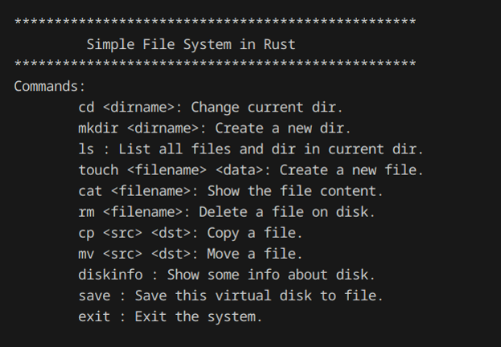

# rust_file_system

基于Rust实现的一个小型虚拟文件系统,实现了最基本的存储和读取文件的功能。

## 运行

```sh
cargo run
```

## 功能列表

| 命令                          | 描述                     |
|-------------------------------|--------------------------|
| `cd <dirname>`                | 更改当前目录             |
| `touch <filename>`            | 创建新文件                 |
| `ls`                          | 列出当前目录下的所有文件 |
| `cat <filename>`              | 查看文件内容             |
| `mkdir <dirname>`             | 新建目录                 |
| `cp <filename> <path>`        | 复制文件至指定位置（仅文件）          |
| `rm <filename>`               | 删除文件                 |
| `mv <filename> <path>`        | 移动文件（重命名文件）      |
| `save`                        | 保存文件系统             |
| `diskinfo`                    | 查看磁盘使用情况         |
| `exit`                        | 退出程序                 |

## 系统框架

### 数据结构

- 磁盘：磁盘中以FAT存储每个块当前的状态，并记录数据

```rust
pub enum FATItem {
    UnUsed, // 未使用
    Cluster(usize), // 指向下一块
    BadCluster, // 损坏块
    EOF //  文件结束
}

pub struct Disk {
    pub fat: Vec<FATItem>,
    pub data: Vec<u8>
}
```

- 文件：文件分为文件与文件夹两类，以Fcb中存储的first_cluster索引存储的数据。Fcb则通过目录中的列表索引。

```rust
pub enum FileType {
    File,
    Directory,
}

pub struct Fcb {
    name: String,
    file_type: FileType,
    first_cluster: usize, // 起始块号
    length: usize,
}

pub struct Directory {
    name: String,
    files: Vec<Fcb>,
}
```

- 磁盘操作：操作会在磁盘上的当前目录进行。

```rust
pub struct DiskOperator {
    pub disk: Disk,
    pub cur_dir: Directory,
}
```

### 数据索引

设计采用了`FAT`文件系统的思想，通过`FATItem`和`Fcb`实现了文件的索引管理。每个文件通过其`first_cluster`字段指向磁盘上的起始块，而`FAT`表则维护了文件数据块之间的链接关系。目录管理通过`Directory`结构实现，目录中的文件通过`Fcb`管理，目录可以通过名称查找文件，并确定文件的类型。整个磁盘通过`Disk`结构表示，包含了`FAT`表和数据区域，能够有效地支持文件的读写和索引。

## UI设计

运行初需要用户选择是读取指定虚拟磁盘还是新建一个虚拟磁盘


在加载磁盘之后，会加载一个显示可用命令的UI界面，记录了可使用命令与其具体用法。交互行以`$`号开头。


## 具体实现

- `cd`: 将当前的状态存储至磁盘，通过名称索引对应文件夹的`Fcb`，在系统内部通过`Fcb`记录的初始块号在磁盘中索引对应的目录的数据簇，读出数据。
- `mkdir`: 先创建一个新的空目录，为其增添应有的`.`和`..`文件夹的`Fcb`，其中`..`文件夹的初始块号应与当前所在文件夹相同。将新文件夹的数据写入磁盘后，就将该新文件夹的`Fcb`添加到当前目录的列表中。当前文件夹的数据有修改不过不必立即写入磁盘，因此此时所需的数据已在内存中可随时读取。保存至磁盘只有在切换当前路径的情况下才会进行。
- `ls`: 实现了`Diretory`的`Display trait`，只需从`Fcb`列表中将所需信息读出即可。
- `cat`: 该命令将根据名称索引对应文件`Fcb`块， 利用`Fcb`记录的初始块号将文件数据从磁盘读出。
- `rm`: 同理，通过名称索引`Fcb`，再通过Fcb记录的初始块号找到对应数据簇，删除只需要将对应块状态置为`Unused`，不需要删除其中数据。
- `diskinfo`: 该命令会读出`BLOCK_SIZE`，并检索`Unused`块的个数，最后得到所需数据。
- `mv`: 该命令会先取出进行操作的文件的`Fcb`，从当前文件夹删除该`Fcb`，之后通过临时的当前目录变量，层层索引`path`并记录，直到找到目标最后一级文件夹，将`Fcb`存入该文件夹列表。由于此时内存读取的并非该目录，因此最后需要将该目录内的数据重写入磁盘给下次读取。被操作文件的数据不需要变动，依旧留在源数据簇即可。
- `touch`: 新建文件，判断无同名文件，再将文件`Fcb`计入当前文件夹列表，文件数据写入磁盘。
- `cp`: 与`mv`不同，他不将当前目录的文件删除，因此需要将文件中的内容读出。此外，当索引到目标文件夹后，将在该文件夹中新建同样数据的文件，先将文件Fcb加入，文件内容写入磁盘，最后将该目录的更新写入磁盘。
- `save`: 将内存中的`Disk`全部写入本地。

## TODO

- 为cd实现多级目录的进入
- 为cp实现文件夹的复制
- 命令行中实现当前路径输出(Solved)
